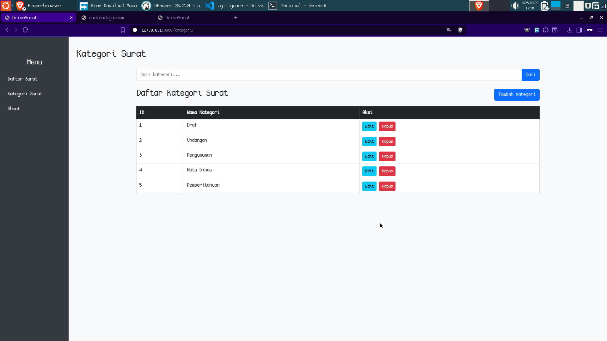
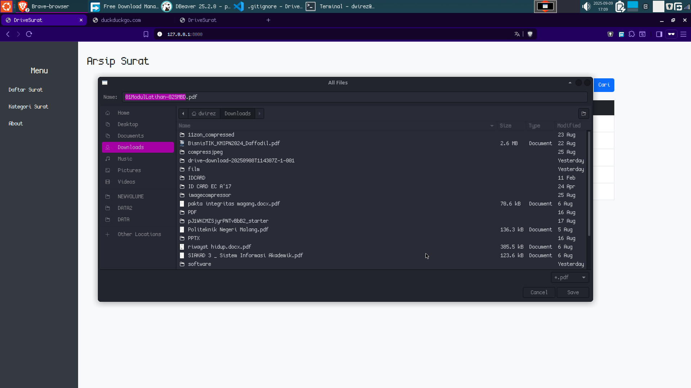

# DriveSurat

Aplikasi Arsip Surat Digital

## Tujuan
DriveSurat adalah aplikasi web untuk mengelola arsip surat masuk/keluar secara digital, memudahkan pencarian, pengelompokan, dan pengunggahan surat berbasis PDF.

Aplikasi ini dibuat untuk memenuhi kebutuhan Ujian LSP Polinema

## Fitur
- Manajemen surat: upload, edit, hapus, lihat detail
- Kategori surat dinamis: tambah/edit/hapus kategori
- Pencarian surat berdasarkan judul
- Preview PDF langsung di browser
- Notifikasi sukses/gagal dengan toast
- File PDF tersimpan di folder media
- Otomatis load data contoh (fixture) saat build Docker
- Dukungan PostgreSQL (tidak menggunakan SQLite)

## Cara Menjalankan

### 1. Persiapan
- Pastikan Docker dan docker-compose terinstall
- Salin `.env.example` menjadi `.env` dan sesuaikan jika perlu

### 2. Build & Jalankan
```bash
docker compose up -d --build
```
Aplikasi akan otomatis migrate dan load data contoh jika database kosong.

### 3. Akses Web
Buka browser ke:
```
http://localhost:8000/
```

### 4. Manajemen Data
- Upload surat: menu "Arsip Surat >> Unggah"
- Tambah kategori: menu "Kategori Surat"
- File PDF tersimpan di folder `media/`


### 5. Screenshot

#### Halaman Tentang


#### Daftar Arsip Surat


#### Edit Kategori Surat


#### Edit Surat


#### Konfirmasi Hapus Surat


#### Lihat Kategori


#### Lihat Surat


#### Fitur Pencarian


#### Tambah Kategori


#### Unduh Surat


#### Unggah Surat


